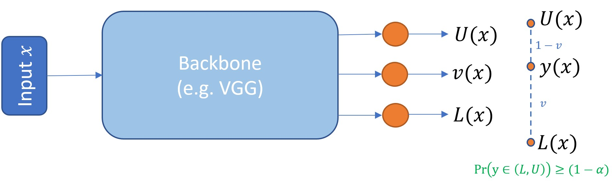

# PIVEN: A Deep Neural Network for Prediction Intervals with Specific Value Prediction

The official implementation of the paper ["PIVEN: A Deep Neural Network for Prediction Intervals with Specific Value Prediction"](https://arxiv.org/abs/2006.05139)
by Eli Simhayev, Gilad Katz and Lior Rokach. 

## Update 21.6.22
Our paper has been accepted to Knowledge Based Systems 🙂 

https://doi.org/10.1016/j.knosys.2022.108685


&nbsp;


## Contents
```
├── age
│   ├── Bone age ground truth.xlsx --- RSNA Bong Age Ground-Truth
│   ├── get_age_data.sh --- Download dataset from kaggle
│   ├── main.py --- Run bone age experiment
├── imdb
│   ├── densenet.py
│   ├── generators.py
│   ├── get_imdb_data.sh --- Download dataset
│   ├── imdb_create_db.py --- Run after downloading the dataset
│   ├── main.py --- Run imdb age estimation experiment
│   ├── model.py
│   ├── subpixel.py
│   ├── tensorflow_backend.py
│   ├── train_callbacks.py
│   └── utils.py
└── uci
    ├── code
    │   ├── DataGen.py
    │   ├── DeepNetPI.py
    │   ├── alpha_experiment.py --- Run alpha experiment on UCI 
    │   ├── main.py --- Run UCI experiments
    │   ├── params_deep_ens.json --- deep ensembles hyperparameters
    │   ├── params.json --- piven and qd hyperparameters
    │   └── utils.py
    ├── get_song_dataset.sh --- Download Year Prediction MSD dataset
    └── UCI_Datasets
```

## Requirements
* pandas==0.25.2
* numpy==1.18.1
* matplotlib==3.0.3
* tensorflow==1.15.0
* keras==2.3.1
* xlrd==1.2.0
* scikit-learn==0.22
* tqdm==4.45.0
* opencv-python==4.2.0.34

To install requirements:

```setup
pip install -r requirements.txt
```

All experiments tested on Ubuntu 18.04 with Python 3.6.

## Quickstart in Google Colab

A simple fast colab demo using Keras is included in [PIVEN_Demo.ipynb](https://colab.research.google.com/github/elisim/piven/blob/master/PIVEN_Demo.ipynb).

## Acknowledgements

Our UCI experiments were inspired by Tim Pearce's implementation of [High-Quality Prediction Intervals for Deep Learning:
A Distribution-Free, Ensembled Approach](https://github.com/TeaPearce/Deep_Learning_Prediction_Intervals). Moreover, in 
IMDB age estimation experiment we used the preprocessing implemented in 
[SSR-Net: A Compact Soft Stagewise Regression Network for Age Estimation](https://github.com/shamangary/SSR-Net).

## Citing PIVEN
If you use PIVEN in your research please use the following BibTeX entry:

```BibTeX
@article{simhayev2022integrated,
  title={Integrated prediction intervals and specific value predictions for regression problems using neural networks},
  author={Simhayev, Eli and Katz, Gilad and Rokach, Lior},
  journal={Knowledge-Based Systems},
  volume={247},
  pages={108685},
  year={2022},
  publisher={Elsevier}
}
```


